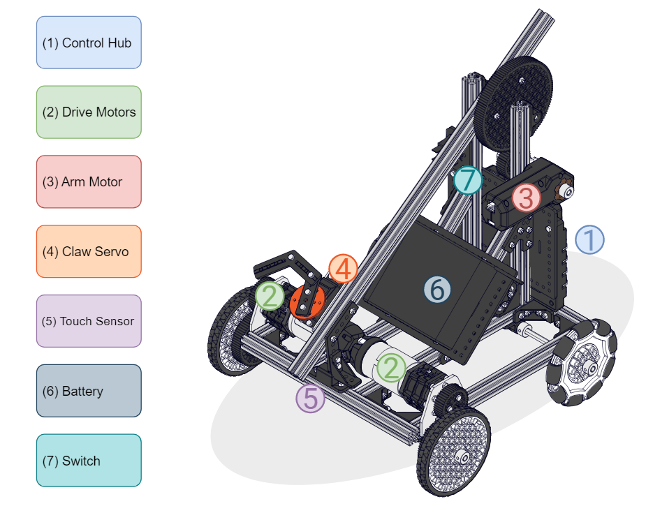

# Hello Robot - Robot Control

With the basics of controlling actuators and getting feedback from sensors is understood from [Hello Robot - Test Bed](../hello-robot-test-bed/), it is time to start configuring and programming our robot for Teleoperated and Autonomous control!&#x20;

| Section                                          | Goals of Section                                                                                                  |
| ------------------------------------------------ | ----------------------------------------------------------------------------------------------------------------- |
| [Create a Basic Robot ](./#create-a-basic-robot) | Introduces a potential robot to work with as well as the configuration file used in the following sections.       |
| [Drivetrain Basics](./#drivetrain-basics)        | Differences between differential and omnidirectional drivetrains and their affect on teleoperated control types.  |


Before continuing it is recommended to complete, at minimum, a drivetrain. There are a few different options depending on the kit being used. For this guide the Class Bot V2 is used. [Check out the build guide for full building instructions](https://docs.revrobotics.com/duo-build/ftc-starter-kit-class-bot) for the Class Bot V2!


## Create a Basic Robot&#x20;

The graphic below highlights the major hardware components of the Class Bot V2. These components are important to understand for the configuration process.                                                                                                                                                                                                                                                                                                                                                                                                                                                                                                                                      &#x20;

<figure><figcaption></figcaption></figure>

The [Hello Robot - Configuration ](../hello-robot-configuration.md)section focused on configuring the components in the Test Bed. In order to continue forward with the Robot Control programming sections, a new configuration file must be made for the components on the robot. It is your choice what variable names you would like to assign to your robot, but for reference this guide will use the following names for each hardware component.&#x20;

| Hardware Component | Hardware Type                            | Name       |
| ------------------ | ---------------------------------------- | ---------- |
| Right Drive Motor  | REV Robotics UltraPlanetary HD Hex Motor | rightmotor |
| Left Drive Motor   | REV Robotics UltraPlanetary HD Hex Motor | leftmotor  |
| Arm Motor          | REV Robotics Core Hex Motor              | arm        |
| Claw Servo         | Servo                                    | claw       |
| Touch Sensor       | REV Touch Sensor                         | touch      |

## Drivetrain Basics&#x20;

Before continuing it is important to understand the mechanical behavior of different drivetrains. The two most common drivetrain categories types are Differential and Omnidirectional.  The Class Bot's drivetrain is a differential drivetrain. The table below highlights the main features of these two types of drivetrains. &#x20;

<figure><figcaption></figcaption></figure>

| Differential Drivetrains                                                                                        | Omnidirectional Drivetrains                                                |
| --------------------------------------------------------------------------------------------------------------- | -------------------------------------------------------------------------- |
| Most common type of drivetrain                                                                                  | Can move in any direction due to rollers on the wheels                     |
| Moves along a central axis                                                                                      | Varies power to each wheel to change heading or strafe                     |
| Applies more power to one side of the drivetrain than the other to change heading                               | More complex programming                                                   |
| Can have different names depending on the number of motors, wheels, and wheel types used (4WD, 6WD, West Coast) | Requires more than 2 motors (depending on specific type and configuration) |

### Teleoperated Control Types

There are a number of different ways to control a robot teleoperated. When using the REV Control System this is done with a Driver Station Device and gamepads. There are various ways to use a controller to drive a differential drivetrain. Two of the conventional ways are **Tank Drive** and **Arcade Drive**.

#### Tank Drive

For tank drive, each side of the differential drivetrain is mapped to its own joystick. Changing the position of each joystick allows the drivetrain to steer and change its heading. Sample code exists in the Robot Controller Application to control a differential drivetrain in this way.

#### Arcade Drive

For arcade drive, each side of the differential drivetrain is controlled by a single joystick. Changing position of the joystick changes the power applied to each side of the drivetrain allowing for a given command. Arcade drives typically have left/right movement of the joystick set to spin the robot about its axis with forward/back moving the robot forward and reverse. More information on Arcade drive are found in the [Robot Navigation - Blocks](robot-navigation-blocks/) and [Robot Navigation - OnBot Java](robot-navigation-onbot-java/) sections.

With the robot configured, a basic understanding of drivetrains, and teleoperated control types, we can move forward to programming the drivetrain to get the robot moving.
